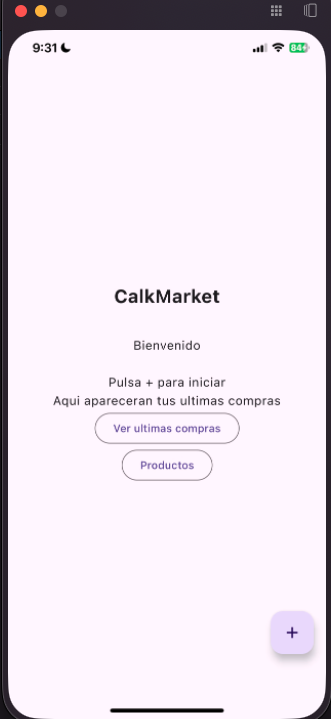
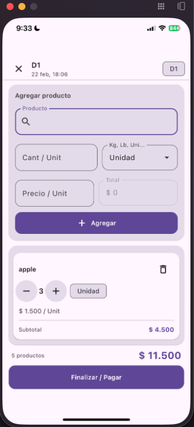
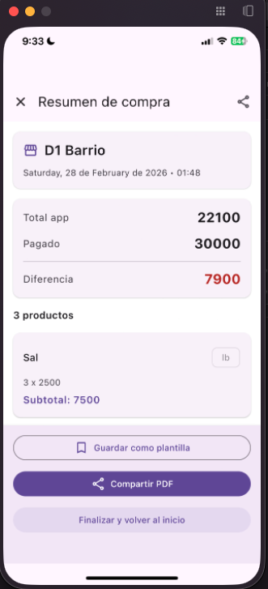
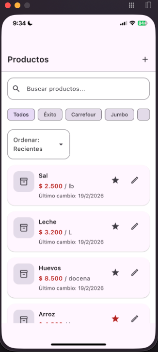

# 🛒 CalkMarket

Aplicación que te ayuda con las compras del súper, agregando y editando tus productos en la canasta.

---

## 📱 Descripción

Aplicación que te ayuda con las compras del súper, permitiéndote **agregar, editar y organizar** tus productos en la canasta de compras. Desarrollada con **Kotlin Multiplatform**, compartiendo lógica entre **Android** e **iOS** desde una única base de código.

## ✨ Características

- ➕ Agrega productos a tu lista de compras
- ✏️ Edita cantidades y detalles de cada producto
- 📋 Visualiza el detalle completo de cada producto
- 🧺 Administra tu canasta de compras en tiempo real
- 📱 Multiplataforma: una sola base de código para Android e iOS

## 📸 Capturas de pantalla

|                    Home                    |                 Formulario                 |
|:------------------------------------------:|:------------------------------------------:|
|  |  |

|                   Detalle                    |                   Productos                    |
|:--------------------------------------------:|:----------------------------------------------:|
|  |  |

## 🛠️ Stack tecnológico

- **Kotlin Multiplatform (KMP)** — lógica compartida entre plataformas
- **Android** — cliente nativo
- **iOS** — cliente nativo

## 📄 Licencia

Este proyecto está bajo la licencia MIT. Consulta el archivo LICENSE para más detalles.